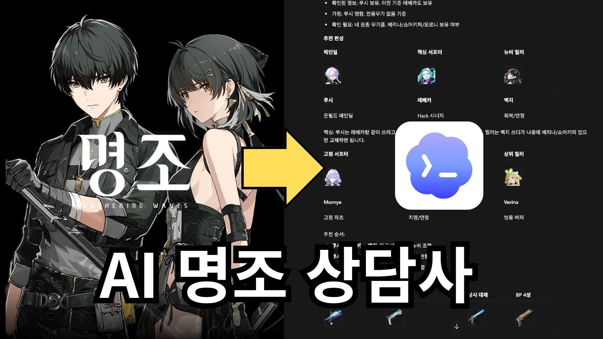

<p align="center">
  
</p>

<h1 align="center">Wuthering Consultant</h1>

<p align="center">
  <strong>AI-assisted Codex skill for Wuthering Waves / 명조 account consulting</strong>
</p>

<p align="center">
  
  
  
  
  
</p>

<p align="center">
  <a href="#korean">한국어</a> ·
  <a href="#english">English</a> ·
  <a href="#japanese">日本語</a> ·
  <a href="#chinese">中文</a>
</p>

<p align="center">
  <sub>Fan-made / Unofficial. Not affiliated with, endorsed by, sponsored by, or approved by Kuro Games or any related right holder.</sub>
</p>

---

<a id="korean"></a>
<details open>
<summary><strong>한국어</strong></summary>

## 개요

`wuthering-consultant`는 Codex에서 사용하는 **명조: 워더링 웨이브 / Wuthering Waves 상담 보조 스킬**입니다. 공명자, 무기, 에코, 소나타, 파티 조합, 로테이션, 뽑기 판단, 계정 성장 우선순위를 한국어 중심으로 상담하도록 설계되어 있습니다.

## 주요 기능

- 공명자 빌드, 무기, 에코, 소나타 세트, 파티 조합 진단
- 초보자/복귀자 기준 성장 우선순위와 재화 투자 방향 제안
- 스크린샷 기반 공명자, 무기, 에코, 스킬, 로스터 상태 추출 보조
- 최신 메타, 배너, 신규 공명자, 무기 추천 등 버전 의존 정보는 웹 출처 확인 후 답변하도록 설계
- 로컬 이미지 캐시를 사용해 공명자, 무기, 에코, 소나타, 재료 아이콘을 Markdown 상담에 첨부
- 요청 시 시각 자료, 카드, HTML 리포트 생성용 스크립트 제공

## 저장소 구조

```text
wuthering-consultant/
  SKILL.md                 # Codex가 읽는 메인 스킬 지침
  agents/                  # 보조 에이전트 프롬프트
  references/              # 상담 기준, 추출 스키마, 출력 규칙
  scripts/                 # 에셋 조회, 검증, 카드/리포트 렌더링 도구
  data/                    # 공식 seed, fixture, 에셋 메타데이터
  assets/wuthering-assets/ # 공명자/무기/에코/소나타/재료 이미지 캐시
  docs/assets/             # README 표시용 이미지
  examples/                # 샘플 상담 JSON 및 렌더링 예시
  generated/               # 로컬 생성 결과용 폴더, Git에는 결과물 제외
```

## 설치

Codex skills 폴더에 이 저장소를 clone합니다.

```powershell
git clone https://github.com/engineer-502/Wuthering-consultant-skill.git "$env:USERPROFILE\.codex\skills\wuthering-consultant"
```

macOS / Linux:

```bash
git clone https://github.com/engineer-502/Wuthering-consultant-skill.git ~/.codex/skills/wuthering-consultant
```

이미 Codex를 켜둔 상태였다면 설치 후 Codex를 재시작하거나 스킬 목록을 다시 로드하세요.

## 사용 예시

```text
$wuthering-consultant 양양 추천 파티랑 무기, 에코 알려줘
```

```text
$wuthering-consultant 막 시작한 뉴비인데 개척자, 양양, 설지, 루시가 있어. 파티를 어떻게 짜고 뭐부터 키워야 해?
```

```text
$wuthering-consultant 루시 전용 무기까지 뽑았어. 무기, 에코, 소나타, 추천 파티랑 육성 순서 알려줘.
```

## 이미지 및 에셋 캐시

이 저장소에는 상담 표시를 위한 공명자, 무기, 에코, 소나타, 재료 이미지 캐시가 포함되어 있습니다. 상담 중 추천 항목이 정해지면 `scripts/query_asset_cache.py`가 로컬 이미지를 찾아 Markdown 표나 카드에 연결합니다.

```powershell
python scripts\query_asset_cache.py "Lucy" --kind resonator --format markdown --thumb-size 48
python scripts\query_asset_cache.py "Freeze Frame" --kind weapon --format paths
```

## 검증

```powershell
python scripts\validate_seed.py data\seed\wuwa_official_3_4_seed.json
python scripts\run_smoke_tests.py
```

macOS / Linux:

```bash
python scripts/validate_seed.py data/seed/wuwa_official_3_4_seed.json
python scripts/run_smoke_tests.py
```

## 공개 배포 및 개인정보 원칙

이 저장소는 공개 설치를 전제로 합니다. 개인 계정 스크린샷, 플레이 기록 원본, 로컬 사용자 경로, 작업 로그, API key, access token, cookie, secret, credential, Codex 내부 실행 폴더, 임시 산출물, 캐시성 bytecode는 포함하지 않는 것을 원칙으로 합니다.

## 법적 고지 및 책임 의무 (Fan-made / Unofficial)

이 문서는 프로젝트의 공개 배포 목적 고지이며, 법률 자문이 아닙니다. 실제 법적 판단이나 분쟁 대응은 관할 법령과 전문가 검토를 따르세요.

### AI 판단 및 사용 책임 면책

이 프로젝트와 `wuthering-consultant` 스킬이 제공하는 빌드 진단, 무기/에코/소나타/파티 추천, 로테이션, 뽑기 조언, 리소스 투자 판단, 이미지 분석 결과, 웹 출처 요약 등은 AI가 생성하거나 보조한 참고 정보입니다.

사용자는 해당 정보를 최종 판단의 참고 자료로만 사용해야 하며, 실제 게임 플레이, 과금, 계정 운용, 콘텐츠 재배포, 제3자 자료 사용, 플랫폼 정책 준수 여부에 관한 결정은 전적으로 사용자 본인의 책임입니다.

본 프로젝트의 관리자 및 기여자는 AI 분석 결과의 정확성, 최신성, 완전성, 특정 목적 적합성, 게임 내 성능 향상, 계정 안전성, 외부 플랫폼 정책 준수 여부를 보증하지 않습니다. AI 판단을 신뢰하거나 적용하여 발생하는 손해, 손실, 계정 제재, 정책 위반, 권리 침해, 데이터 손상, 기회비용, 기타 직간접 결과에 대한 귀책사유는 법령상 허용되는 최대 범위에서 사용자 또는 해당 행위자 본인에게 있습니다.

### 팬메이드 비공식 프로젝트 고지

이 프로젝트는 팬메이드 비공식 Codex 스킬 및 Wuthering Waves / 명조 상담 보조 도구입니다.

`Wuthering Waves`, `명조: 워더링 웨이브`, `Kuro Games`, `KURO GAMES` 및 관련 명칭, 로고, 캐릭터, 공명자, 무기, 에코, 게임 이미지, 게임 데이터, 기타 콘텐츠의 권리는 각 권리자에게 있습니다.

이 저장소는 공식 제품이 아니며, Kuro Games, KURO GAMES 또는 그 관계사, 퍼블리셔, 라이선서, 권리자와 제휴, 승인, 후원, 보증 관계가 없습니다.

본 프로젝트는 비상업적 목적의 팬 활동과 개인 학습/도구화 목적을 전제로 하며, 사용자는 본 프로젝트와 포함 리소스를 상업적 목적으로 사용해서는 안 됩니다. 본 프로젝트에 포함되거나 참조된 제3자 코드, 이미지, 데이터, 리소스, 문서, API, 라이브러리는 각 원저작자 및 해당 라이선스 조건을 따릅니다.

권리자 또는 대리인의 삭제, 수정, 비공개 요청이 접수될 경우, 관리자는 해당 콘텐츠를 지체 없이 제거하거나 비공개 처리할 수 있습니다. GitHub DMCA 또는 기타 권리침해 신고가 접수될 경우, 해당 플랫폼 정책과 관련 법령에 따라 즉각적인 조치를 취합니다.

### 면책 및 책임 범위

본 저장소는 "있는 그대로(AS IS)" 제공되며, 특정 목적 적합성, 정확성, 완전성, 지속적 동작, 무중단 제공, 오류 없음, 최신 게임 버전과의 호환성을 보증하지 않습니다.

사용자가 본 저장소를 다운로드, 설치, 실행, 수정, 재배포, 포크, 인용하거나 포함 리소스를 사용하는 과정에서 발생한 모든 결과는 해당 사용자 또는 행위자 본인의 책임입니다. 저장소 관리자 및 기여자는 법령상 허용되는 최대 범위에서, 본 프로젝트 사용 또는 사용 불가로 인해 발생한 직간접적, 우발적, 특별, 결과적 손해에 대해 책임을 지지 않습니다.

### 권리자 문의 / 삭제 요청

권리자 또는 대리인은 아래 연락처로 삭제, 수정, 비공개 또는 권리 관련 요청을 보낼 수 있습니다.

Contact: axwhalesolution@gmail.com

권리자의 정당한 요청이 확인될 경우 즉각적인 조치(삭제/수정/비공개)를 진행합니다.

</details>

---

<a id="english"></a>
<details>
<summary><strong>English</strong></summary>

## Overview

`wuthering-consultant` is a **Codex skill for Wuthering Waves account consulting**. It helps with resonator builds, weapons, echoes, sonata sets, team composition, rotations, pull decisions, and account progression priorities.

## Features

- Build diagnostics for resonators, weapons, echoes, sonata sets, and teams
- Beginner and returning-player progression guidance
- Screenshot-assisted extraction for resonators, weapons, echoes, skills, and rosters
- Source-aware answers for version-sensitive topics such as banners, new resonators, weapons, and meta changes
- Local icon cache for Markdown answers and visual recommendation tables
- Optional scripts for visual cards and HTML reports

## Install

```powershell
git clone https://github.com/engineer-502/Wuthering-consultant-skill.git "$env:USERPROFILE\.codex\skills\wuthering-consultant"
```

macOS / Linux:

```bash
git clone https://github.com/engineer-502/Wuthering-consultant-skill.git ~/.codex/skills/wuthering-consultant
```

Restart Codex or reload the skill list after installing.

## Usage

```text
$wuthering-consultant Recommend a beginner team, weapons, and echoes for Yangyang.
```

You can attach screenshots of resonators, weapons, echoes, skills, rosters, inventory, or endgame progress.

## Verify

```powershell
python scripts\validate_seed.py data\seed\wuwa_official_3_4_seed.json
python scripts\run_smoke_tests.py
```

## Legal Notice and Liability Disclaimer

This project is fan-made and unofficial. It is not affiliated with, endorsed by, sponsored by, or approved by Kuro Games, KURO GAMES, its affiliates, publishers, licensors, or any related right holder.

All names, logos, characters, resonators, weapons, echoes, game images, game data, and other Wuthering Waves content belong to their respective right holders.

Advice generated or assisted by this skill, including build diagnostics, weapon/echo/team recommendations, rotations, pull advice, resource planning, image analysis, and source summaries, is for reference only. Users are solely responsible for their gameplay, spending decisions, account operations, redistribution, third-party content use, and compliance with applicable policies and laws.

The repository is provided "AS IS" without warranties of accuracy, completeness, fitness for a particular purpose, uninterrupted operation, account safety, policy compliance, or compatibility with the latest game version. To the maximum extent permitted by law, maintainers and contributors are not liable for direct, indirect, incidental, special, consequential, or other damages arising from use or inability to use this project.

Rights holders or authorized representatives may request removal, correction, or restriction of content.

Contact: axwhalesolution@gmail.com

</details>

---

<a id="japanese"></a>
<details>
<summary><strong>日本語</strong></summary>

## 概要

`wuthering-consultant` は、**Wuthering Waves / 鳴潮のアカウント相談を支援する Codex スキル**です。共鳴者の育成、武器、音骸、ハーモニー効果、編成、ローテーション、ガチャ判断、育成優先度の相談を補助します。

## 主な機能

- 共鳴者、武器、音骸、ハーモニー効果、編成の診断
- 初心者・復帰者向けの育成優先度とリソース投資案
- スクリーンショットからのキャラクター、武器、音骸、スキル、所持状況の読み取り補助
- バナー、新キャラクター、武器評価、メタ変化などバージョン依存情報は出典確認を前提に回答
- ローカル画像キャッシュによる Markdown 表示用アイコンの添付
- 必要に応じたカード画像や HTML レポート生成スクリプト

## インストール

```powershell
git clone https://github.com/engineer-502/Wuthering-consultant-skill.git "$env:USERPROFILE\.codex\skills\wuthering-consultant"
```

macOS / Linux:

```bash
git clone https://github.com/engineer-502/Wuthering-consultant-skill.git ~/.codex/skills/wuthering-consultant
```

インストール後、Codex を再起動するかスキル一覧を再読み込みしてください。

## 使用例

```text
$wuthering-consultant 初心者向けに秧秧の編成、武器、音骸を教えて。
```

共鳴者、武器、音骸、スキル、所持キャラクター、インベントリ、エンドコンテンツ進行状況のスクリーンショットを添付できます。

## 検証

```powershell
python scripts\validate_seed.py data\seed\wuwa_official_3_4_seed.json
python scripts\run_smoke_tests.py
```

## 法的告知および免責

本プロジェクトはファンメイドの非公式プロジェクトです。Kuro Games、KURO GAMES、その関連会社、パブリッシャー、ライセンサー、その他の権利者とは提携、承認、後援、保証関係にありません。

`Wuthering Waves`、`鳴潮`、`Kuro Games`、関連する名称、ロゴ、キャラクター、共鳴者、武器、音骸、ゲーム画像、ゲームデータ、その他のコンテンツの権利は、それぞれの権利者に帰属します。

このスキルが生成または補助するビルド診断、武器・音骸・編成提案、ローテーション、ガチャ判断、リソース投資、画像解析、出典要約などは参考情報です。実際のプレイ、課金、アカウント運用、再配布、第三者資料の利用、各種ポリシーや法令の遵守は、すべて利用者本人の責任です。

本リポジトリは「現状有姿(AS IS)」で提供され、正確性、完全性、特定目的への適合性、継続的な動作、アカウント安全性、ポリシー遵守、最新バージョンとの互換性を保証しません。法令で認められる最大限の範囲で、管理者および貢献者は本プロジェクトの使用または使用不能により生じる損害について責任を負いません。

権利者または代理人は、削除、修正、非公開、その他の権利関連の要請を送ることができます。

Contact: axwhalesolution@gmail.com

</details>

---

<a id="chinese"></a>
<details>
<summary><strong>中文</strong></summary>

## 概述

`wuthering-consultant` 是一个用于 **Wuthering Waves / 鸣潮账号咨询的 Codex skill**。它可以辅助分析共鸣者培养、武器、声骸、套装、队伍搭配、循环、抽取建议和账号养成优先级。

## 功能

- 共鸣者、武器、声骸、套装和队伍搭配诊断
- 面向新手和回归玩家的养成优先级建议
- 辅助读取角色、武器、声骸、技能、角色池和库存截图
- 对卡池、新角色、武器评价、版本机制和环境变化等时效信息优先要求来源确认
- 使用本地图片缓存，在 Markdown 回复和推荐表中展示图标
- 提供可选的图片卡片和 HTML 报告生成脚本

## 安装

```powershell
git clone https://github.com/engineer-502/Wuthering-consultant-skill.git "$env:USERPROFILE\.codex\skills\wuthering-consultant"
```

macOS / Linux:

```bash
git clone https://github.com/engineer-502/Wuthering-consultant-skill.git ~/.codex/skills/wuthering-consultant
```

安装后请重启 Codex，或重新加载 skill 列表。

## 使用示例

```text
$wuthering-consultant 给新手推荐秧秧的队伍、武器和声骸。
```

你也可以附上共鸣者、武器、声骸、技能、角色池、库存或深塔/终局内容进度截图。

## 验证

```powershell
python scripts\validate_seed.py data\seed\wuwa_official_3_4_seed.json
python scripts\run_smoke_tests.py
```

## 法律声明与责任免责声明

本项目为粉丝制作的非官方项目。它与 Kuro Games、KURO GAMES、其关联方、发行方、许可方或任何相关权利人不存在从属、授权、赞助、认可或担保关系。

`Wuthering Waves`、`鸣潮`、`Kuro Games` 以及相关名称、标志、角色、共鸣者、武器、声骸、游戏图片、游戏数据和其他内容的权利均归各自权利人所有。

本 skill 生成或辅助生成的配装诊断、武器/声骸/队伍推荐、循环建议、抽取建议、资源投入判断、图片分析和来源摘要等内容仅供参考。实际游戏、付费、账号操作、内容再分发、第三方资料使用以及平台政策和法律合规，均由用户自行负责。

本仓库按“现状(AS IS)”提供，不保证准确性、完整性、特定用途适用性、持续运行、账号安全、政策合规或与最新游戏版本兼容。在法律允许的最大范围内，维护者和贡献者不对因使用或无法使用本项目而产生的任何直接、间接、偶然、特殊、后果性或其他损害承担责任。

权利人或授权代表可以请求删除、修改、隐藏或处理相关权利问题。

Contact: axwhalesolution@gmail.com

</details>
